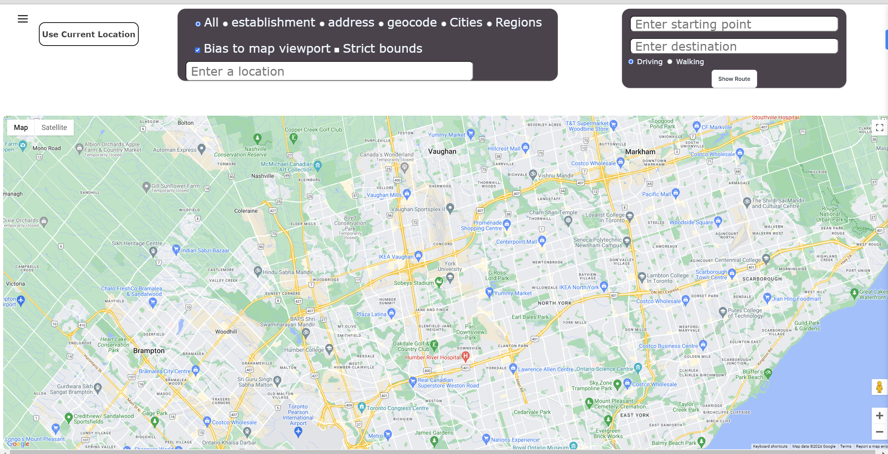
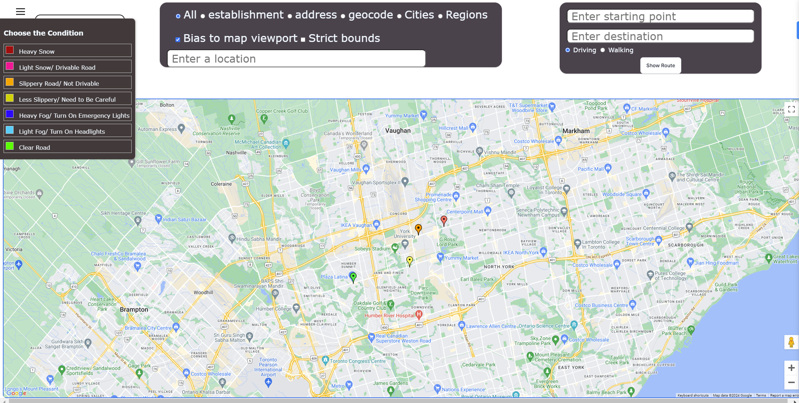

# Winter Watch - ElleHacks2024

## Overview
Winter Watch is a website that allows people to share their experiences from the local roads to help others stay up to date, avoid possible injuries, and decide the best way to approach their desired location.

## Background
Winter time, especially in Canada, can be a challenging time. The roads get blocked by snow and the sidewalks can stay icy for days. So whether you have a car or you're just a pedestrian, it can be difficult to travel without knowing the road conditions. We decided to create Winter Watch to allow people to share their observations from the roads and pathways. This keeps people well-informed and helps them to decide the best possible route to their destination by trying to avoid harsh weather conditions.

## How to use
Visit <https://winterwatch.co/> to access the website.

## Screenshots

&nbsp;&nbsp;&nbsp;&nbsp;

